# rocks
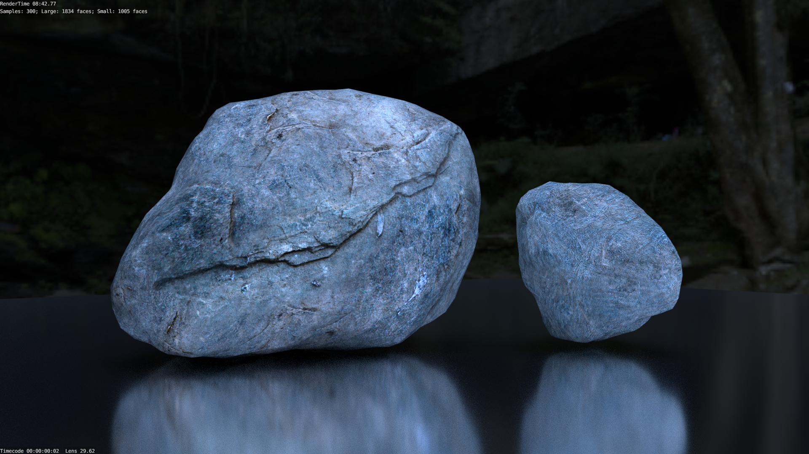
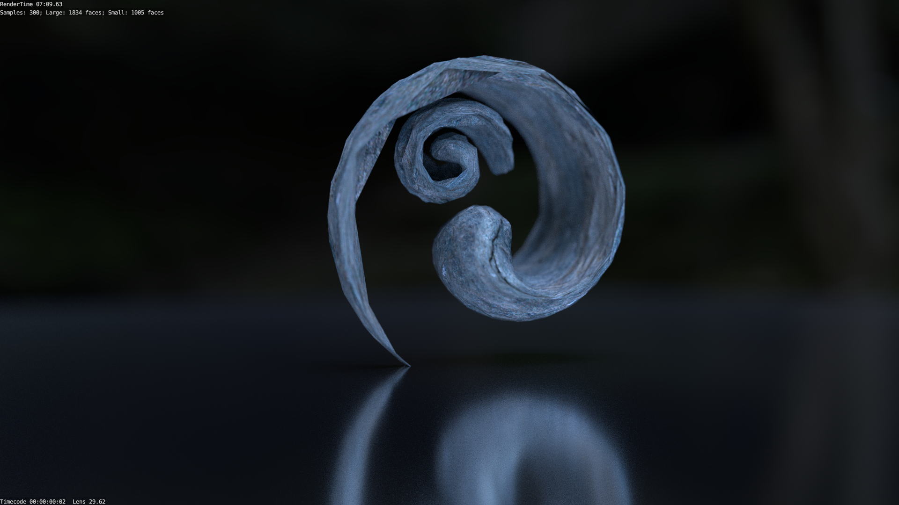

# nx alien
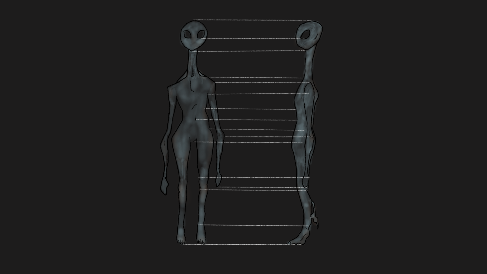
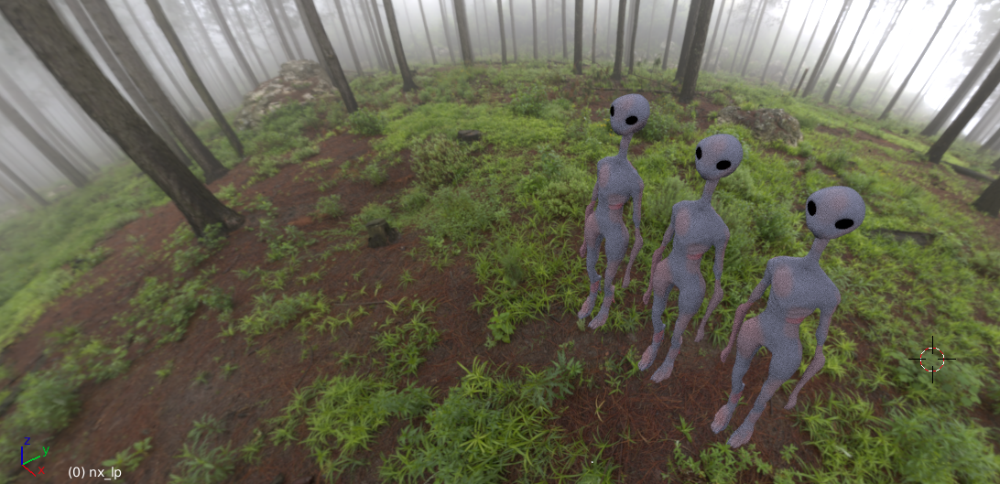

## [binarytrails.net/nx](https://www.binarytrails.net/nx)

# khamaí
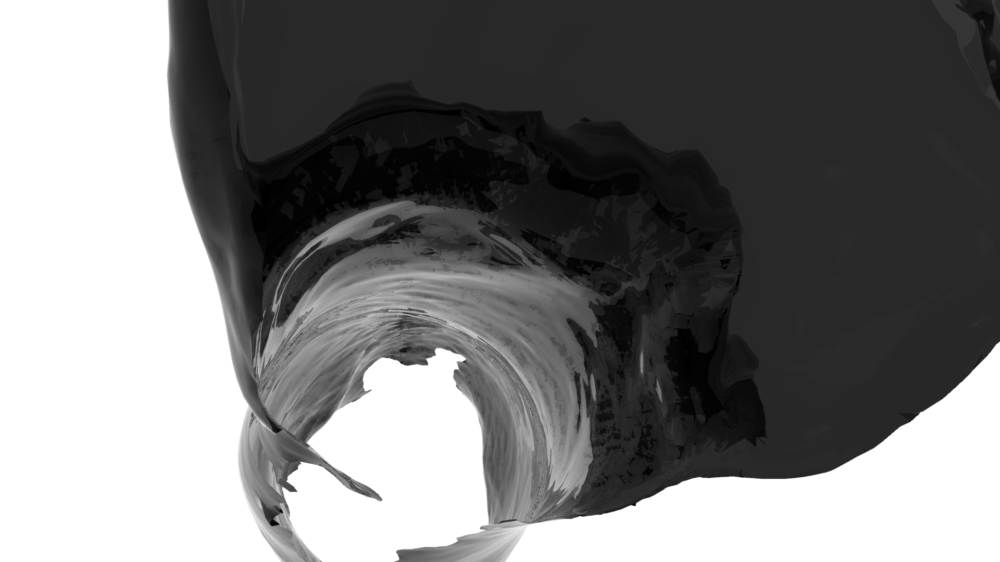
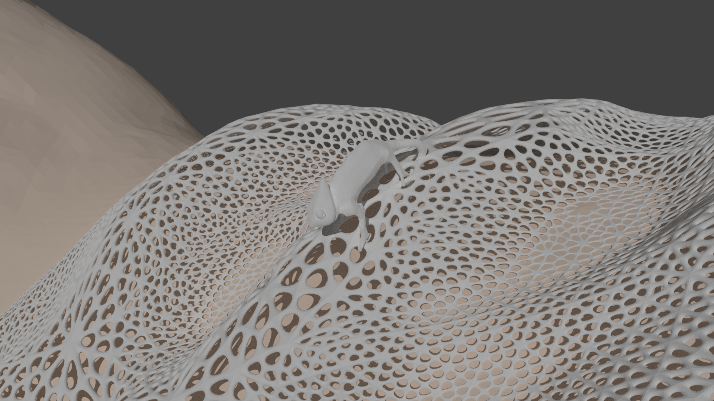

## [binarytrails.net/khamaí](https://www.binarytrails.net/khama)

# motorbike
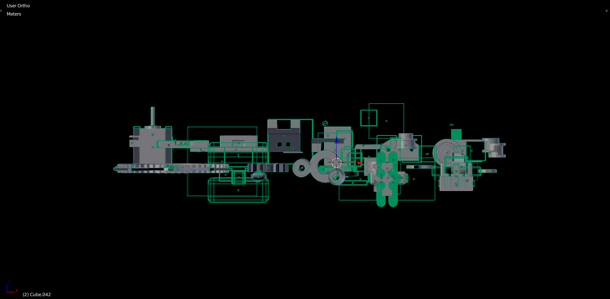
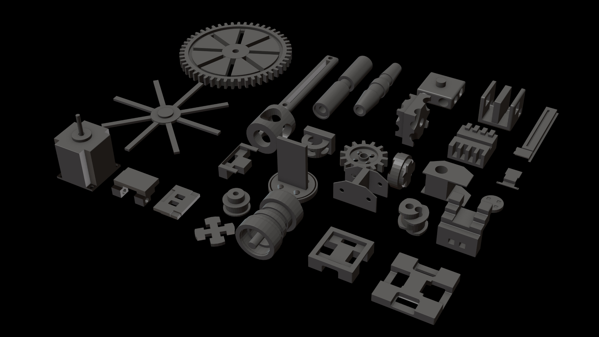
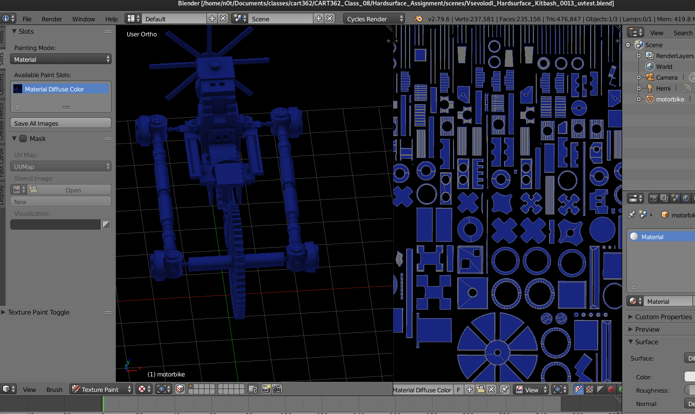
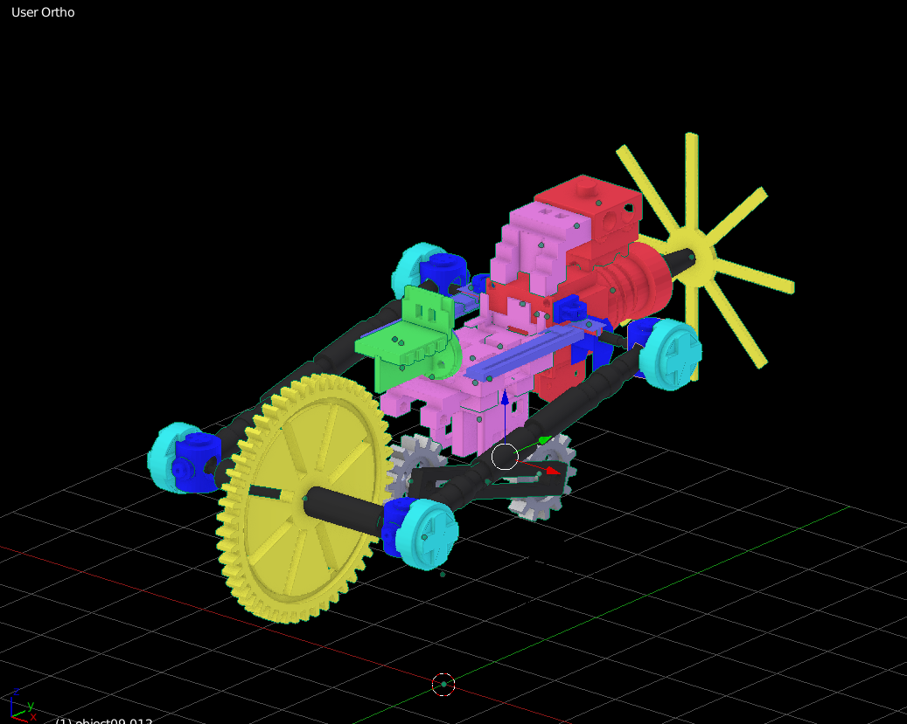
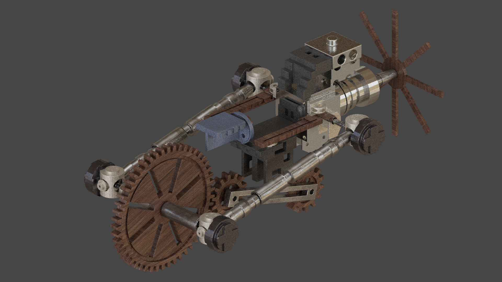

# seahorse
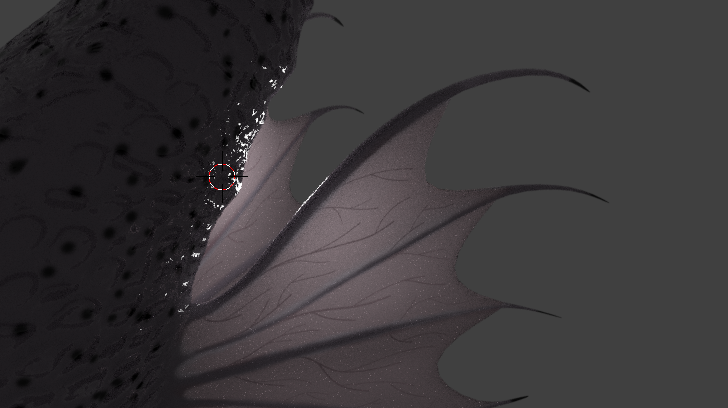
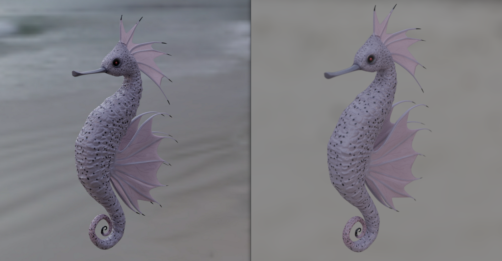

## [vimeo/seahorse](https://vimeo.com/303762317)

# place-d'armes
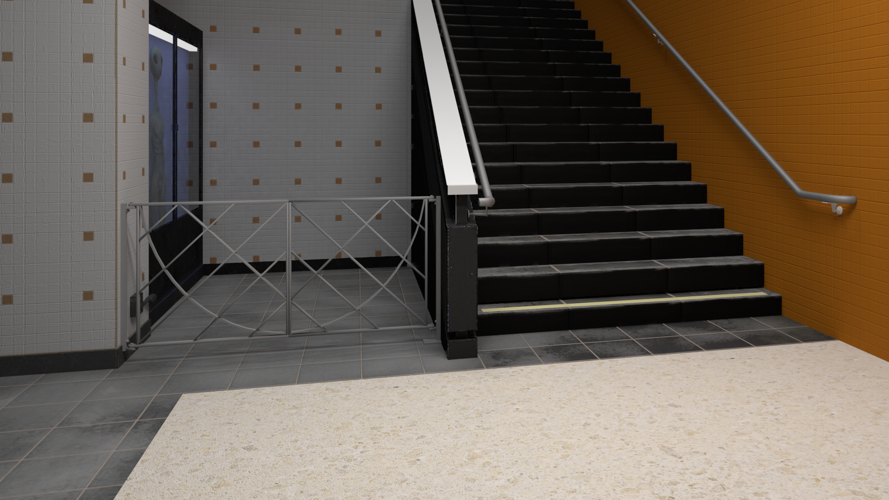
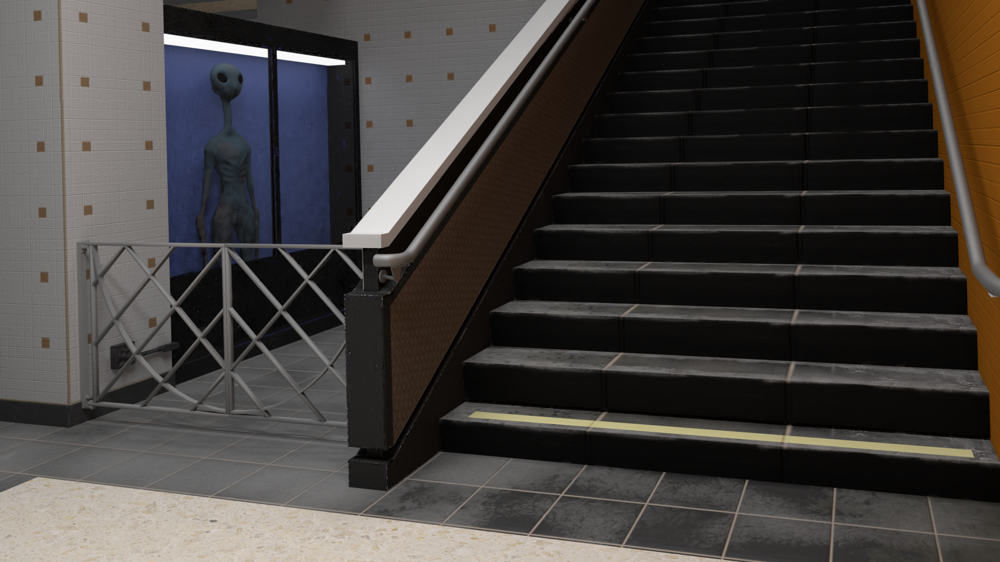

----
Vsevolod Ivanov - seva@binarytrails.net
